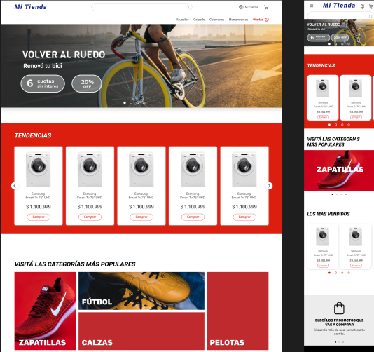

# 🛒 **Pierce E-commerce - Página de Inicio**

Bienvenido a **Pierce E-commerce**, una página de inicio para un sitio web de comercio electrónico, diseñada con **React**, **TypeScript** y **CSS**. Este proyecto está enfocado en ofrecer una interfaz de usuario limpia, moderna y totalmente responsiva, brindando una excelente experiencia de navegación para los usuarios.

---

## 📋 **Índice**

- [Características](#características)
- [Tecnologías Utilizadas](#tecnologías-utilizadas)
- [Instalación](#instalación)
- [Uso](#uso)
- [Capturas de Pantalla](#capturas-de-pantalla)

---

## 🌟 **Características**

- **📱 Diseño Responsivo**: Optimizado para dispositivos móviles y escritorios.
- **🛒 Vitrina de Productos**: Despliegue de productos destacados en una cuadrícula visualmente atractiva.
- **🔍 Búsqueda Intuitiva**: Navegación rápida y fácil para encontrar los productos.
- **💳 Preparado para E-commerce**: Interfaz ideal para incorporar funcionalidades de compra.
- **🎨 Estilos Personalizados**: CSS diseñado a medida para la identidad visual del eCommerce.
- **⚡ Rápido y Eficiente**: Usando React para garantizar una rápida experiencia del usuario.

---

## 🛠️ **Tecnologías Utilizadas**

- **React**: Librería de JavaScript para construir interfaces de usuario.
- **TypeScript**: Superconjunto de JavaScript que aporta tipado estático y seguridad en el desarrollo.
- **CSS**: Hojas de estilo personalizadas para el diseño visual.
- **HTML5**: Marcado semántico para el contenido de la web.

---

## 🚀 **Instalación**

Sigue estos pasos para ejecutar el proyecto localmente:

### **Requisitos Previos**

Asegúrate de tener **Node.js** y **npm** instalados. Puedes descargar Node.js desde [aquí](https://nodejs.org/).

### **Clonación del Repositorio**

Clona este repositorio en tu máquina local usando el siguiente comando:

git clone https://github.com/tu-usuario/ecommerce-home.git

### **Instalación de Dependencias**

Navega a la carpeta del proyecto y ejecuta el siguiente comando para instalar todas las dependencias necesarias:

cd ecommerce-home
npm install
Iniciar el Servidor
Inicia el servidor de desarrollo:

npm start
Ahora abre tu navegador y visita http://localhost:3000 para ver la página de inicio.

### 🖼️ **Capturas de Pantalla**
Aquí puedes agregar algunas capturas de pantalla para mostrar la interfaz de tu página de inicio.

Interfaz principal de la página de inicio de Pierce E-commerce.
Vista responsiva en dispositivos móviles.

